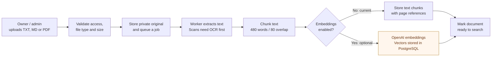
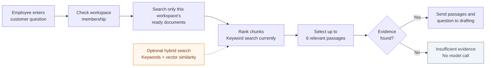
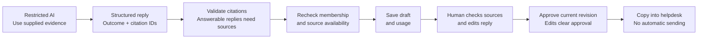

# AgentHarbor: how document-grounded replies work

RAG means Retrieval-Augmented Generation: retrieve company evidence, then draft a reply using that evidence. It does not train the model on uploaded documents.

## 1. Prepare company knowledge

## 2. Retrieve relevant evidence

## 3. Draft, validate and review

## What improves accuracy

- Overlap preserves nearby context; document and page references make evidence inspectable.
- Workspace scoping restricts retrieval to authorized company knowledge.
- The drafting agent has no tools and is instructed to avoid invented policies and treat document instructions as untrusted.
- Missing evidence gets a safe fallback. The model is instructed to flag ambiguity or conflicting sources when evidence is supplied.
- Citation validation and human review add checks. Valid citation IDs do not prove that every claim is supported.

## Current limitations

Keyword search missed "Can I get my money back?" in a refund-policy test. Hybrid embeddings are implemented but not enabled or live-verified. OpenAI returned exhausted API credits during testing, so successful live answer quality remains unverified. RAG reduces unsupported answers; it does not guarantee accuracy.

Implementation: `backend/app/services/knowledge.py`, `backend/app/worker/support.py`, `backend/app/agents/support.py` under `my_ai_app/`.
