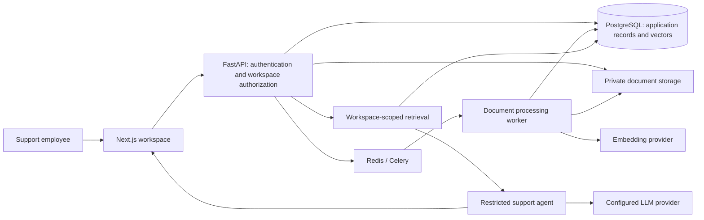

# AgentHarbor customer-support assistant: implementation plan

Status: local functional pilot implemented; production rollout and live-provider evaluation pending. Prepared 2026-09-20.

## Implementation status (2026-09-20)

The generated application now includes workspace/team management, invitations, a knowledge library, a durable native worker, bounded document parsing, scoped keyword retrieval with optional OpenAI embeddings, support cases, structured cited drafting, editable revisions, approval/copy controls, feedback, usage limits and isolation tests. Additive migrations are `0029_support` and `0030_support_owner_retention`.

The local environment lacks pgvector and a running Docker engine, so the pilot uses PostgreSQL job dispatch/private file bytes and bounded exact retrieval instead of the proposed pgvector/Redis/Celery/object-storage deployment. See [decision 0004](decisions/0004-support-pilot.md) and the [support runbook](runbooks/support-pilot.md) for the actual implementation and limitations. Screens share the support workspace component; case/document selection is in-page rather than separate detail URLs. Progress uses polling rather than streaming. Invitation tokens are shared manually.

The user selected OpenAI and requested that paid live tests remain pending. Customer interviews, a customer-supplied held-out evaluation set, paid model/embedding verification, production infrastructure, restore/load testing and pilot business-outcome measurements remain open. The estimates and targets below are the original plan, not achieved results. No provider key or fabricated live answer was added.

## 1. Product outcome

Help a support employee turn a customer question into an accurate, editable reply using their company's approved documents. Show the evidence behind the reply. When the documents do not answer the question, ask for clarification or recommend escalation instead of inventing company policy.

Initial customer hypothesis: small software companies with a support team and FAQs, product guides, and policy documents. Validate this audience before building the full product.

The first release is an internal drafting assistant. Staff paste a question, review the draft and sources, edit it, and copy it into their existing helpdesk. Copying does not mean the reply was sent. Automatic customer replies, refunds, account changes, and other external actions are outside this release.

## 2. Existing foundation and gaps

The product lives in `my_ai_app/`; the repository also contains a separate application generator.

| Area | Existing foundation | Work required |
| --- | --- | --- |
| Identity | Authentication, users, application admin | Company workspaces, memberships, invitations, workspace roles |
| Conversation | Personal conversations, messages, sharing | Separate workspace support cases and draft history |
| AI | PydanticAI, server-managed OpenAI/OrcaRouter selection | Restricted support agent, retrieval, structured drafts and citations |
| Files | Owner-scoped chat attachments and storage service | Workspace knowledge upload, extraction, indexing, versioning and deletion |
| Memory | Persistent personal agent memory | Keep personal memory out of company support answers |
| Data | PostgreSQL and Alembic migrations | Workspace tables, knowledge chunks, vectors, support workflow records |
| UI | Next.js, auth pages, dashboard, settings | Knowledge library, reply editor, source viewer, team settings |
| Quality | Backend/frontend checks and browser smoke tests | Tenant isolation tests, retrieval evaluations, worker recovery tests |

RAG ingestion, retrieval, and vector-store implementations exist under `template/{{cookiecutter.project_slug}}/backend/app/services/rag/`. They are reference code, not enabled functionality in this app. Review and adapt useful parts with tests; do not regenerate over the customized application or assume template code is workspace-safe.

## 3. MVP scope

Include:

- Workspace creation and switching; owner/admin/agent roles.
- Invite existing or new users through expiring, single-use invitations. Begin with owner-copied invite links; automated invitation email needs a configured email provider.
- Upload English text PDFs, TXT and Markdown files. Add DOCX only if discovery shows it is essential.
- Show upload, processing, ready, failed and archived states; provide actionable failure messages and retry.
- Search approved company knowledge and generate a cited draft.
- Review, edit, approve and copy a draft; retain revision history.
- Save support cases, retrieve previous drafts, and collect feedback.
- Workspace document, storage, generation and concurrency limits.
- Basic operational metrics and a workspace usage view.

Defer helpdesk/email/WhatsApp connectors, website crawling, scanned-PDF OCR, automatic sending, billing, customer-facing chatbots, document-level permissions, customer account lookups and multilingual promises. All workspace members can read that workspace's approved knowledge and support cases in the MVP; do not onboard teams needing finer access controls until those exist.

## 4. User journeys and screens

### Workspace owner

1. Create a workspace and set its name, support tone and escalation instructions.
2. Upload a small set of approved FAQs, policies and product guides.
3. Watch processing progress; resolve unsupported or empty documents.
4. Run a sample question and inspect its cited passages.
5. Invite support staff and set usage limits.

### Support employee

1. Open `/support` and create a case by pasting a customer question.
2. Click **Draft reply** once; see retrieval and generation progress, with cancellation.
3. Read the proposed reply beside its sources and any missing-information notice.
4. Open a source to inspect the precise supporting passage and document version.
5. Edit and approve the draft, then copy it into the existing helpdesk.
6. Optionally mark it helpful or report an incorrect claim/source.

### Proposed frontend routes

| Route | Main contents |
| --- | --- |
| `/support` | Case history, search, new case |
| `/support/[id]` | Customer question, draft editor, sources, revisions, feedback |
| `/knowledge` | Documents, statuses, upload, retry, replace, archive/delete |
| `/knowledge/[id]` | Metadata, versions, extracted content, processing errors |
| `/settings/workspace` | Name, tone and escalation settings |
| `/settings/team` | Members, invitations and roles |
| `/settings/usage` | Storage, generation usage and remaining allowance |

Build within the existing locale/dashboard layout. Include mobile layouts, keyboard access, accessible progress indicators, empty states, network failures and permission failures. Preserve unsaved edits after failed saves or generation. Do not display a fabricated numerical confidence percentage.

## 5. Architecture and infrastructure

- Keep Next.js, FastAPI, SQLAlchemy and PostgreSQL. Follow routes → services → repositories.
- Proposed search store: PostgreSQL with pgvector, avoiding a separate vector database for the pilot. Confirm extension availability on the actual database before committing to this choice. The current native PostgreSQL installation does not establish that pgvector is installed.
- Start with workspace-filtered exact vector search plus PostgreSQL text search and rank fusion. Evaluate recall before introducing approximate indexes. pgvector documents that approximate-index filtering can reduce returned results; benchmark tenant-filtered queries before an index change: [pgvector documentation](https://github.com/pgvector/pgvector).
- Proposed ingestion worker: Celery with Redis, running in Linux containers for local Windows development and deployment. First verify compatibility with the project's locked dependencies and Python version. Jobs must be idempotent and retry safely: [Celery task guidance](https://docs.celeryq.dev/en/stable/userguide/tasks.html).
- Use private local storage for development and private object storage for deployed originals. Serve downloads only after authorization or through short-lived authorized URLs. Never place company files in frontend `public/`.
- Treat embedding configuration separately from generation configuration. Do not assume that the selected chat gateway supports embeddings. Pin and record embedding model, vector dimension and extraction/chunking versions.
- Keep provider keys server-side. Per-user keys are outside the MVP. Document which provider receives document text and customer questions during pilot onboarding.

Preflight deliverable: a working disposable environment with the extension, worker, storage and embedding provider, without altering existing user data. If pgvector cannot be provisioned, decide on a separate development database or alternative store before schema work.

## 6. Data model and authorization

All new company-owned records carry `workspace_id`. Use workspace-qualified foreign keys or equivalent database constraints to prevent cross-workspace relationships. Authorize membership at every API operation, including source previews, streaming, exports and downloads. Derive the acting user from the session; validate every supplied workspace ID.

| Entity | Important fields |
| --- | --- |
| `workspaces` | ID, name, settings, status |
| `workspace_memberships` | Workspace, user, role; unique workspace/user |
| `workspace_invitations` | Workspace, normalized email, role, token hash, expiry, consumed/revoked time |
| `knowledge_documents` | Workspace, title, active version, state, creator |
| `knowledge_versions` | Workspace, document, checksum, private storage key, parser version, status |
| `knowledge_chunks` | Workspace, document version, ordinal, text, page/section, embedding and model version |
| `ingestion_jobs` | Workspace, version, state, attempts, lease/heartbeat, sanitized error |
| `support_cases` | Workspace, creator, customer question, title, status |
| `support_drafts` | Workspace, case, revision, original generation, edited text, outcome, approver |
| `draft_citations` | Draft, source version/chunk, excerpt, citation label |
| `generation_runs` | Workspace, case, idempotency key, status, model/prompt versions, timing and usage |
| `usage_events` | Workspace, operation, tokens/bytes, provider-reported usage, timestamps |
| `audit_events` | Workspace, actor, action, object reference, time |

Role policy: owner controls ownership and workspace deletion; owner/admin manage documents and members; agents read approved knowledge and create/review drafts. Prevent removing or demoting the last owner. Application-wide admin status must not silently grant routine access to all company documents.

Existing personal conversations, attachments and memory remain personal. Do not automatically share or reassign them. Existing users explicitly create/join workspaces. Review public registration's first-user-admin bootstrap before exposing a public pilot; provision the deployment owner deliberately.

Migration approach: additive tables and indexes, no destructive backfill. Test against a copy of the current schema. Store embeddings for one selected model/dimension initially; later model changes require re-embedding into a new version before switching reads.

## 7. Knowledge ingestion and lifecycle

1. Authorize upload and check workspace quota before accepting a bounded stream.
2. Validate filename, declared MIME type and file signature; reject oversized, encrypted, unsupported or unreadable files. Configure an initial limit of 10 MB and 200 pages, then revisit after pilot measurements.
3. Store the original privately and create a version plus durable ingestion job. Use an outbox/dispatcher or equivalent recovery mechanism so a committed upload cannot lose its queued job.
4. Scan untrusted files and parse in an isolated worker with CPU, memory and time limits. Surface scanned/empty PDFs as requiring OCR rather than marking them ready.
5. Extract text while preserving page numbers, headings and source offsets. Remove extraction noise conservatively.
6. Begin with roughly 400–800-token chunks and 50–100-token overlap; tune against evaluation data rather than treating these as fixed requirements.
7. Generate embeddings in bounded batches, with timeouts and retry only for transient failures.
8. Persist chunks idempotently. Publish the new document version atomically only after processing succeeds.
9. Keep the previous ready version active during replacement. Failed replacement must not remove working knowledge.
10. On archive/delete, immediately exclude the document from retrieval and invalidate related caches. Purge blobs, chunks and embeddings asynchronously according to the retention policy. A running job must check deletion state before publishing.

Old drafts retain source identifiers/version metadata. If a source is deleted, show it as unavailable; hard deletion must also purge stored excerpts that would otherwise preserve deleted content. Explain backup retention separately. Reprocessing and job redelivery must not create duplicate chunks or usage charges recorded twice.

## 8. Retrieval and draft generation

1. Authorize the support case, check the generation allowance and reserve capacity atomically.
2. Persist a generation run using a client request/idempotency key. A double-click returns the same run instead of starting another paid request.
3. Retrieve only ready, active knowledge from the authorized workspace. Apply this restriction to lexical and vector queries, cache keys, source lookups and background work.
4. Combine lexical and semantic candidates, remove duplicates, and fit selected passages into a bounded context budget. Start with up to 20 candidates and 5–8 final passages, then evaluate.
5. Use a dedicated support agent with no web browsing, shell, general-purpose tools or personal memory. Customer questions and retrieved files are untrusted content, not instructions that can override the support task.
6. Request structured output: `answerable`, `needs_clarification`, `insufficient_evidence`, or `conflicting_sources`; reply text; citation references; follow-up question/escalation reason where applicable.
7. Require citations for factual company-policy/product claims. Validate that cited chunk IDs were actually supplied and still belong to active authorized sources. This validates provenance, not truth; semantic support also needs evaluations and human review.
8. Do not produce an ordinary definitive answer for missing or conflicting evidence. Present a clarification/escalation draft instead.
9. Save the generated revision, retrieved evidence references, model/prompt versions and usage. Human edits create a new revision and invalidate previous approval. Citations are not automatically proof of newly edited claims.
10. Stream progress and optionally provisional text, but keep copy/approval unavailable until source validation finishes. Handle disconnects, cancellation and provider errors without losing the staff member's edited text. Report partial provider usage when available; never assume cancellation is free.

## 9. API and code changes

Proposed FastAPI routes under `/api/v1`, with corresponding frontend proxy handlers using the existing auth/cookie conventions:

| Endpoint group | Operations |
| --- | --- |
| `/workspaces` | Create/list; read/update authorized workspace |
| `/workspaces/{id}/members` | List members, change role, remove member |
| `/workspaces/{id}/invitations` | Create/revoke invitation; separate authenticated acceptance endpoint |
| `/workspaces/{id}/knowledge` | List/upload documents; inspect version, replace, retry, archive/delete, authorized preview |
| `/workspaces/{id}/support/cases` | Create/list/read/update cases |
| `/workspaces/{id}/support/cases/{case_id}/generations` | Start idempotent generation; status/events/cancel |
| `/workspaces/{id}/support/cases/{case_id}/drafts` | Read/save revisions, approve, record copy event, feedback |
| `/workspaces/{id}/usage` | Read consumption and limits |

Return 202 for queued ingestion/generation, consistent permission/not-found behavior, 409 for stale edits, 413 for oversized uploads and 429 for quota exhaustion. Do not retry non-idempotent requests blindly. Use version checks on draft saves so two employees cannot silently overwrite each other.

Implementation locations:

- `backend/app/db/models/`, `schemas/`, `repositories/`: new workspace, knowledge and support entities.
- `backend/app/services/knowledge/`: ingestion orchestration, extraction and retrieval.
- `backend/app/services/support.py`: case/draft lifecycle and usage policy.
- `backend/app/agents/support.py`: restricted prompt, dependencies and structured output.
- `backend/app/api/deps.py`: workspace authorization dependencies and service wiring.
- `backend/app/api/routes/v1/`: workspace, knowledge and support routes.
- `backend/app/worker/`: ingestion tasks and dispatch/recovery.
- `backend/alembic/versions/`: incremental schema migrations.
- `frontend/src/app/[locale]/(dashboard)/`: new screens.
- `frontend/src/components/knowledge/`, `components/support/`, `hooks/`: UI and workspace-qualified data queries.
- `frontend/src/app/api/`: authenticated proxy endpoints and streaming.
- `docs/decisions/`, `docs/runbooks/`, `.env.example`: decisions, deployment/recovery guidance and documented configuration.

Names are proposed and should be reconciled with repository conventions during implementation. Changes target the generated app; generator/template parity is a separate project.

## 10. Delivery sequence and acceptance gates

Estimates assume one full-time experienced developer, prompt customer feedback, and access to a working provider. They are planning ranges, not delivery commitments. Rough total: 35–51 engineering days, plus 1–2 calendar weeks of pilot observation; discovery can change the scope.

| Phase | Work | Estimate | Done when |
| --- | --- | --- | --- |
| 0. Validate and preflight | Interview 3–5 teams, get sanitized example questions/docs, confirm infrastructure and provider compatibility | 2–3 days | One pilot team agrees to trial; supported formats, hosting and success criteria recorded |
| 1. Workspace foundation | Additive migrations, roles, invitations, workspace UI and isolation tests | 4–6 days | Two companies can use the app without accessing each other's records or files |
| 2. Knowledge pipeline | Private upload, worker, extraction, versions, embeddings, library UI | 6–8 days | Supported documents become searchable; failed jobs recover; replacement/deletion are safe |
| 3. Retrieval and evidence | Hybrid retrieval, source previews, labeled evaluation set | 4–6 days | Retrieval meets the initial gate on held-out questions and always enforces workspace scope |
| 4. Support workflow | Restricted agent, draft editor, citations, revisions, approve/copy, feedback | 6–9 days | Staff can complete question → cited draft → edited/copied reply, including no-answer cases |
| 5. Reliability and cost | Usage reservations, quotas, idempotency, audits, telemetry, failure recovery | 4–6 days | Retry/disconnect/rate-limit scenarios are tested without uncontrolled duplicate work |
| 6. Pilot release | Full E2E, adversarial evaluation, load test, restore drill, pilot onboarding | 5–7 days | Quality and operational gates pass; pilot feedback supports wider release |
| 7. Pilot adjustments | Fix observed retrieval/UI issues and repeat affected evaluations | 4–6 days | Pilot target met or a documented decision to narrow/change the product |

Release in reviewable increments: workspace migration/access → workspace UI → ingestion → retrieval → support generation → review UI → quotas/telemetry → pilot release. Include tests with each increment rather than postponing all testing to the end.

## 11. Test and evaluation plan

Keep the existing checks in `docs/quality.md`. Add:

- **Unit tests:** role policy, parser output, chunk provenance, citation validation, draft version conflicts, quota accounting and duplicate jobs.
- **Database/API integration:** upload-to-retrieval; source replacement and deletion; membership revocation; simultaneous generation requests; worker crash/retry; missing/invalid provider credentials; exhausted quota.
- **Isolation:** users from workspace A cannot fetch, search, cite, download, stream, export or mutate B's records, including guessed IDs and stale cached data. Test removed members during active generation and preview requests.
- **Browser journeys:** owner uploads and sees ready status; agent gets and edits a cited reply; source preview opens; reload preserves revisions; mobile navigation; unavailable sources; failed generation; empty knowledge; double-click; expired invitation.
- **Adversarial cases:** embedded instructions in documents, conflicting policies, fabricated source IDs, copied instructions in customer questions, unsupported refund promises and HTML/script content in uploads or drafts.
- **Operational recovery:** Redis/worker outage, repeated task delivery, embedding timeout, database failure, storage failure, source deletion during ingestion, migration on an existing-data copy, backup restore.

Build an initial set of at least 100 sanitized questions with reviewer-labeled evidence: approximately 60 answerable, 20 unanswerable, 10 ambiguous/conflicting and 10 adversarial. Separate development examples from a held-out release set. Pin dataset, parser, embedding and prompt versions. Human review is required; model grading is supplementary.

Proposed pilot gates, to confirm in discovery:

| Measure | Initial target |
| --- | --- |
| Workspace isolation | Zero cross-workspace disclosures in the defined test suite |
| Citation reference validity | 100% of displayed references resolve to authorized supplied sources or explicitly show unavailable |
| Evidence retrieval | Supporting passage in top 5 results for at least 90% of answerable held-out questions |
| Grounded policy/product claims | At least 95% supported by evidence under human review; zero known critical policy errors |
| Missing evidence | Appropriate clarification/escalation on at least 95% of unanswerable held-out questions |
| Draft usefulness | At least 80% rated usable with minor/no edits by pilot staff |
| Business outcome | At least 30% lower median time to an approved reply versus the team's baseline |

These are targets, not guarantees or current product results. Record sample sizes and individual severe failures, not just averages.

## 12. Performance, cost and operations

Measure in a production build with a declared test workload: initially 10 concurrent support users, up to 100 documents/50,000 chunks per workspace, typical 300-token questions and replies capped near 600 tokens. These are benchmark assumptions, not sales limits.

- UI pending feedback target: under 100 ms on the target device.
- Ordinary warmed application reads: p95 under 500 ms.
- Retrieval: p95 under 1 second at the declared corpus size.
- Complete validated draft: initial p95 target under 15 seconds, measured separately by model/provider and output length.
- Typical 20-page text document: initial processing target under 2 minutes; show progress and errors when exceeded.

Record upload/extraction/embedding time, queue age, retrieval time, provider time, first response time, total draft time, error rate and cancellation count. Correlate by request and generation IDs. Do not log keys, raw customer messages or full company documents by default.

Track actual input/output/embedding tokens, provider-reported cost where available, storage and queue usage. Estimate cost per accepted draft from those measurements using current contracted provider prices at implementation time. Keep estimated and billed amounts distinct. Set hard per-workspace allowances and global concurrency ceilings before the pilot; do not offer unlimited usage.

Runbooks must cover stuck ingestion, re-indexing, key rotation, provider outages, queue recovery, restore, source deletion and membership removal. Include health checks for database, storage and worker liveness. Configuration presence does not establish provider availability.

## 13. Deployment and rollback

1. Add example configuration for support feature flags, Redis, private storage, embedding provider/model/dimension, upload limits and generation limits. Do not add real keys to Git.
2. Deploy additive migrations, API and worker with support disabled. Confirm existing auth/chat/memory still pass smoke tests.
3. Enable for an allowlist of pilot workspaces and run end-to-end checks against real embeddings and generation using a bounded test budget.
4. Confirm private storage access, secrets management, backups and a successful restore test before real company documents are uploaded.
5. Increase pilot access only after quality, isolation and performance gates pass.
6. Roll back by disabling support generation/uploads and stopping new job dispatch; retain data and existing app features. Avoid destructive migration downgrades as an automatic rollback. Record how in-flight work is drained or cancelled.

Billing and public self-service signup expansion follow a successful pilot. Before accepting paid subscriptions, add subscription lifecycle, entitlements, payment failure handling and verified usage enforcement as a separate release.

## 14. Decisions to settle during phase 0

- Which support teams will pilot it, and what documents/questions can they share safely?
- Is the English-first, text-document scope sufficient? If Arabic or scanned PDFs are required, revise parsing, evaluation and estimates before proceeding.
- Where will company data be hosted, and what deletion/retention expectations apply?
- Which generation and embedding providers are available with an approved trial budget?
- Is shared knowledge within each workspace acceptable, or are document-level restrictions necessary?
- What is the current time per reply, and what improvement would justify paying for the product?

Recommended first implementation milestone after validation: two isolated workspaces can upload a document, search only their own content and open the exact source passage. Build and verify this before adding polished AI reply generation.
